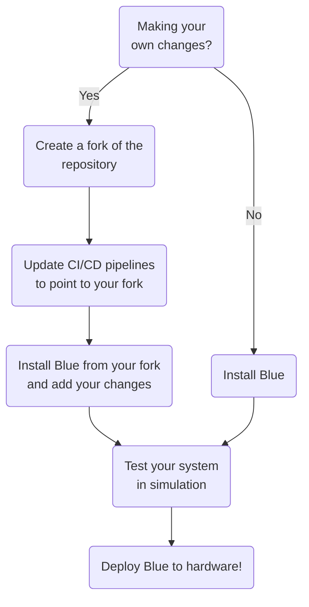

import Vehicle from '@site/src/components/Vehicle';
import BlueROV2 from '@site/static/img/vehicles/bluerov2.png';
import BlueROV2Heavy from '@site/static/img/vehicles/bluerov2_heavy.png'
import BlueROV2HeavyReach from '@site/static/img/vehicles/bluerov2_heavy_reach.png'

# Overview

Blue provides a set of tools implemented using ROS 2 that help you test and
deploy software for underwater vehicles. This is accomplished through the
following features:

1. **Simulation using Gazebo**: Vehicle models and configurations have been
   created for Gazebo. We have found that Gazebo provides a good representation
   of how the vehicle will behave in the real world.
2. **CI/CD pipelines**: Blue implements CI/CD pipelines to help you deploy your
   software in the same environment that you performed development and testing
   in. Docker images are built for the `amd64` and `arm64` CPU architectures so
   that you can easily deploy your software to a variety of hardware platforms.
3. **Development environment**: Blue provides a development environment that
   includes all of the tools you need to develop software for underwater
   vehicles, such as ROS 2, Gazebo, linters, and formatters. This helps you
   avoid spending resources setting up your development environment and focus on
   writing your robotics algorithms 😀
4. **Custom control algorithms**: Blue supports custom
   controllers implemented using [auv_controllers](https://github.com/Robotic-Decision-Making-Lab/auv_controllers).
5. **Localization**: We have implemented several drivers for common underwater
   sensors, and integrate these sensors using the [robot_localization](https://docs.ros.org/en/noetic/api/robot_localization/html/configuring_robot_localization.html)
   package. See [Supported Sensors](/sensors) for more information.

## Recommended workflow

Blue is designed to be flexible and modular, enabling you to make changes
according to the needs of your project. However, our commitment to flexibility
does not compromise our effort to ensure that the provided system caters to
a wide range of use cases. With this in mind, we recommend the following
workflow for using Blue:

## Supported vehicles

Several vehicle models have been implemented and tested with Blue in
**simulation** and on **hardware**. These vehicles include:

   <Vehicle name="BlueROV2" img={BlueROV2}>
      The BlueROV2 is a popular lightweight underwater vehicle made by [Blue Robotics](https://bluerobotics.com/)
      that is used for hobby, research, and commercial applications.
   </Vehicle>
   <Vehicle name="BlueROV2 Heavy" img={BlueROV2Heavy}>
      The BlueROV2 Heavy is an extension to the BlueROV2 made by [Blue Robotics](https://bluerobotics.com/)
      that includes additional thrusters and a larger frame to improve the
      vehicle's manueverability.
   </Vehicle>
   <Vehicle name="BlueROV2 Heavy Reach" img={BlueROV2HeavyReach}>
      The BlueROV2 Heavy Reach modifies the BlueROV2 Heavy by moving the
      thrusters located on the upper chassis to the lower chassis. This was
      proposed by [Reach Robotics](https://reachrobotics.com/) to enable
      integration of a small manipulator for intervention tasks.
   </Vehicle>

## Alternative projects

If you find that Blue does not meet your needs, we recommend exploring the following alternative projects:

- [Orca4](https://github.com/clydemcqueen/orca4)
- [Marine Vehicle Packages (MVP)](https://github.com/uri-ocean-robotics/mvp_readme)
- [UVMS Simulator](https://github.com/edxmorgan/uvms-simulator)
- [CentraleNantesROV bluerov2](https://github.com/CentraleNantesROV/bluerov2)
